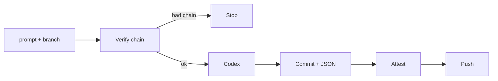

# Attestai

Attestai is a GitHub Actions workflow that generates source code from natural-language prompts using [OpenAI Codex](https://chatgpt.com/codex/) and creates a cryptographic attestation for every commit. The result is a verifiable chain of provenance: anyone can confirm that every line of code in a branch was produced by AI from a specific sequence of prompts, executed by a specific workflow, and signed by GitHub Actions — with nothing altered in between.

## Problem

AI-generated code is everywhere, but there is no standard way to answer a simple question: **"Was this code really produced by AI from the prompt the author claims, or was it modified by hand?"**

- Users downloading an app have no way to verify what actually produced the code.
- A developer can claim "this was 100% AI-generated" but could have injected anything after the fact.
- Open-source audits assume human authors; there is no tooling for auditing prompt-to-code pipelines.

## How It Works



1. A `workflow_dispatch` trigger accepts a **prompt** and a **target branch**.
2. The workflow verifies that every existing commit on the target branch already carries a valid Attestai attestation (unbroken chain).
3. [OpenAI Codex](https://openai.com/index/codex/) runs the prompt inside the GitHub Actions runner and produces code changes.
4. A commit is created with a structured JSON body containing the exact prompt, its SHA-256 digest, the model name, Codex version, and a hash of the workflow file itself.
5. GitHub's [`actions/attest`](https://github.com/actions/attest) signs the raw commit object, creating a Sigstore-backed attestation tied to the workflow identity.
6. The commit is pushed to the target branch.

Because every commit is attested and each run re-verifies the entire chain before extending it, the history of a branch is a tamper-evident log of prompts.

## Verify a Branch

Anyone with the [GitHub CLI](https://cli.github.com/) (`gh`) can verify that a branch's latest commit was produced by the Attestai workflow and has not been tampered with.

### Verify the latest commit attestation

```bash
REPO="ekrembal/attestai" BRANCH="pdf-utils" && gh attestation verify <(gh api "repos/${REPO}/commits/${BRANCH}" -q '. as $c | ["tree \($c.commit.tree.sha)", ($c.parents[]? | "parent \(.sha)"), "author \($c.commit.author.name) <\($c.commit.author.email)> \($c.commit.author.date | fromdateiso8601) +0000", "committer \($c.commit.committer.name) <\($c.commit.committer.email)> \($c.commit.committer.date | fromdateiso8601) +0000", "", $c.commit.message] | join("\n")') -R "$REPO" --signer-workflow "$REPO/.github/workflows/run-attestai.yml"
```

Replace `BRANCH` with any branch name (`qr-tools`, `image-tools`, etc.).

### Read the prompts that built a branch

Every commit message contains the full prompt in its JSON body. List them in chronological order with the model used:

```bash
REPO="ekrembal/attestai" BRANCH="pdf-utils" && gh api "repos/${REPO}/commits?sha=${BRANCH}&per_page=100" --jq '[.[] | select(.commit.message | startswith("Attestai:"))] | reverse | .[] | .commit.message | split("\n\n")[1:] | join("\n\n") | fromjson | "[\(.model)] \(.prompt)"'
```

This prints each prompt prefixed by the model that executed it (e.g. `[gpt-5.4]`), in the order they were run. You can see exactly what instructions the AI was given to produce the code.

## Try the Apps

Each branch is a standalone app built entirely from prompts. You can browse the code or try them out:

| Branch | Description |
|--------|-------------|
| [`pdf-utils`](https://github.com/ekrembal/attestai/tree/pdf-utils) | Client-side PDF toolkit — merge, split, reorder, rotate, delete, and extract pages or text. |
| [`qr-tools`](https://github.com/ekrembal/attestai/tree/qr-tools) | Client-side QR code generator and reader. |
| [`image-tools`](https://github.com/ekrembal/attestai/tree/image-tools) | Client-side image processing utilities. |
| [`document-form-helper`](https://github.com/ekrembal/attestai/tree/document-form-helper) | Client-side document and form helper. |
| [`upload-limit-helper`](https://github.com/ekrembal/attestai/tree/upload-limit-helper) | Client-side upload limit helper. |

Every commit in every branch links back to the prompt that created it. Verify any of them with the commands above.

## Run Your Own

Want to generate your own prompt-attested code? Follow these steps:

### 1. Fork the repository

Fork [ekrembal/attestai](https://github.com/ekrembal/attestai) to your own GitHub account.

### 2. Add your Codex credentials

The workflow needs your OpenAI Codex auth token to run. On a machine where Codex CLI is already logged in, copy the contents of `~/.codex/auth.json`:

```bash
cat ~/.codex/auth.json
```

Then go to your fork's **Settings → Secrets and variables → Actions** and create a new repository secret:

- **Name:** `CODEX_AUTH_JSON`
- **Value:** the full JSON contents of `~/.codex/auth.json`

### 3. Trigger a run

Go to **Actions → Run Attestai** in your fork and fill in:

- **target_branch** — the branch to create or extend (e.g. `my-app`)
- **prompt** — the natural-language instructions for Codex

The workflow will create the branch (if it doesn't exist), run Codex, commit the result with full metadata, attest the commit, and push.

### Security Warning

> **Do not use this in repositories where other people have access.** Repository secrets are exposed to anyone who can trigger workflows in the repo. If collaborators or forks can run Actions in your repository, they can read `CODEX_AUTH_JSON`. Only use this in private, single-user repositories or repositories where you fully trust every collaborator.

## License

This project is licensed under the [GNU General Public License v3.0](LICENSE) (GPL-3.0). See [`LICENSE`](LICENSE) for the full text.

## Prerequisites

- [GitHub CLI](https://cli.github.com/) (`gh`) — required for verification commands and triggering workflows.
- [OpenAI Codex CLI](https://github.com/openai/codex) — required only if you want to set up your own fork (to generate `auth.json`).
